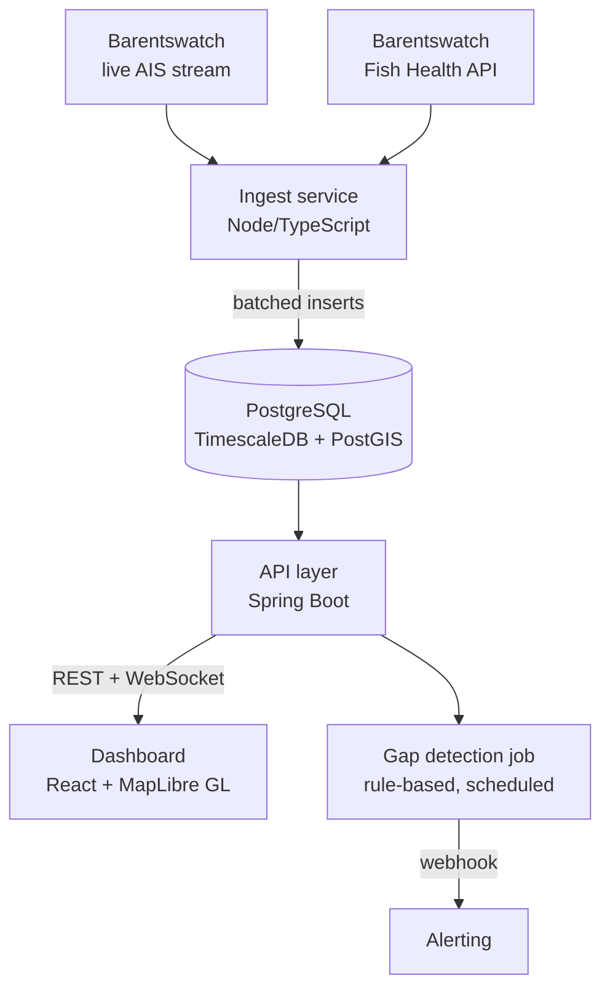

# Marine Monitoring Platform <!-- working title, see open questions in the brief -->

[](https://github.com/MariusReik/MarinProsjekt/actions/workflows/ci.yml)
[](https://github.com/MariusReik/MarinProsjekt/releases)

Real-time marine monitoring for the Norwegian west coast. Live AIS vessel
traffic is ingested, stored as a geospatial time series, and interpreted
**relative to aquaculture sites**: which vessels have been near my locations,
and has anyone stopped transmitting AIS ("going dark") inside my area?

Not another "ships on a map" viewer — the core value is contextualization and
automatic anomaly flagging for site operators.

<!-- TODO (#19): demo GIF here — 10s clip: live map -> click locality -> radius activity -> gap alert -->

## Features

- **Live AIS ingest** from the [Barentswatch](https://developer.barentswatch.no/) stream: reconnect with backoff + jitter, heartbeat timeout, geographic filtering (Vestland bounding box), batched writes with idempotent inserts
- **Time-series storage** in TimescaleDB: hypertables, 30-day raw retention, 5-minute continuous aggregates kept for a year
- **Geospatial queries** with PostGIS: vessel activity within a configurable radius of any aquaculture locality (`ST_DWithin` on `GEOGRAPHY`)
- **REST + WebSocket API** (Spring Boot): vessel history, latest positions, locality analysis; live positions broadcast over STOMP
- **Map dashboard** (React + MapLibre GL): live vessels, historical tracks with selectable time window and direction arrows, toggleable locality layer with radius analysis
- **Anomaly detection**: rule-based AIS-gap detection near monitored localities, with deduplicated webhook alerting
- **Aquaculture localities** auto-refreshed daily from the Barentswatch Fish Health API

## Architecture



The ingest service and the API are deliberately decoupled — they share only
the database. Architectural decisions are recorded in the
[decision log](./prosjektbrief-marin-plattform.md#9-beslutningslogg) (Norwegian).

## Tech stack

| Component | Choice | Why |
|---|---|---|
| Ingest | Node.js / TypeScript | Low-friction stream + JSON handling |
| API | Spring Boot 3, Java 21 | REST/WS, scheduled jobs, Flyway migrations |
| Database | PostgreSQL + TimescaleDB + PostGIS | Time series **and** geospatial are the core of the domain |
| Frontend | React + MapLibre GL | Open source, WebGL performance, no API keys |
| Infra | Docker Compose, GitHub Actions | Reproducible local stack, CI on every PR |

## Getting started

Prerequisites: Docker, Node.js 22+, Java 21 + Maven, and a (free)
[Barentswatch API client](https://www.barentswatch.no/minside/) with scopes
`ais` and `api`.

```bash
# 1. Configure credentials
cp ingest/.env.example ingest/.env    # fill in BW_CLIENT_ID / BW_CLIENT_SECRET

# 2. Database (TimescaleDB + PostGIS, schema bootstraps on first run)
docker compose -f infra/docker-compose.yml up -d postgres

# 3. Ingest: live AIS stream + daily locality refresh
cd ingest && npm install
npm run dev              # AIS stream -> TimescaleDB
npm run dev:localities   # aquaculture localities (separate terminal)

# 4. API
cd api && mvn spring-boot:run    # http://localhost:8080

# 5. Dashboard
cd web && npm install && npm run dev    # http://localhost:5173
```

## API overview

| Endpoint | Description |
|---|---|
| `GET /api/vessels` | Known vessels with metadata |
| `GET /api/vessels/{mmsi}/track?from&to` | Historical track for a vessel |
| `GET /api/positions/latest` | Latest position per vessel |
| `GET /api/localities` | Aquaculture localities |
| `GET /api/localities/{n}/vessels?radiusMeters&hours` | Vessel activity near a locality |
| `WS /ws` → `/topic/positions` | Live position broadcast (STOMP) |

## Project structure

```
ingest/   Node/TypeScript – AIS stream + locality ingest
api/      Spring Boot – REST + WebSocket + anomaly jobs
web/      React + MapLibre GL – map dashboard
infra/    Docker Compose, DB bootstrap SQL
docs/     Architecture notes
```

## Roadmap

**v1 (in progress):** VPS deployment and observability are the remaining
milestones. **Beyond v1** ([backlog](../../issues?q=is%3Aissue+label%3Abacklog)):
ML-based anomaly detection (loitering, trajectory prediction), user accounts
and multi-tenancy, more regions, weather/wave correlation, mobile alerts.

All work is tracked as [GitHub Issues](../../issues) (`v1` label for current
scope). The Norwegian [project brief](./prosjektbrief-marin-plattform.md) is
the source of truth for scope, architecture and the decision log.

## Data source

AIS data from the Norwegian Coastal Administration via
[Barentswatch open APIs](https://developer.barentswatch.no/). Note the open
data limitations: no fishing vessels under 15 m, no leisure craft under 45 m,
Norwegian economic zone only.
